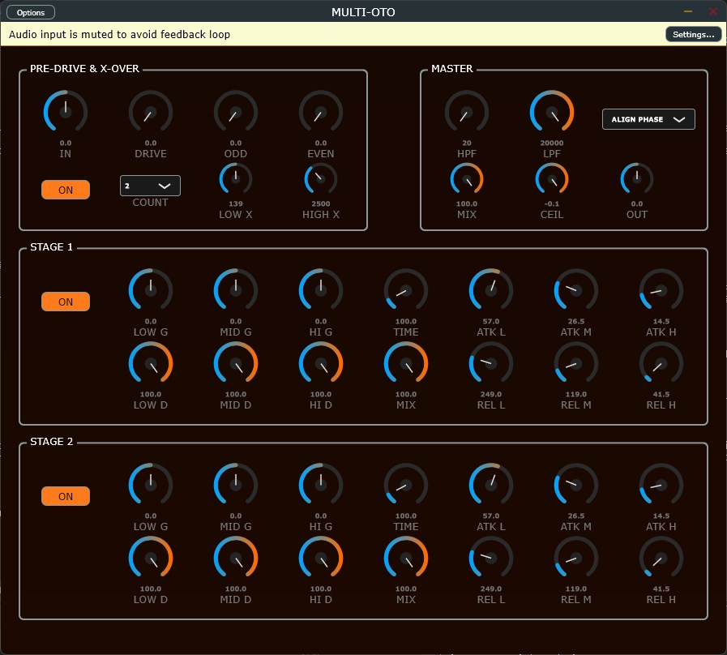

# MULTI-OTO

##

## Overview

**MULTI-OTO** is an open-source, extreme multiband dynamics and saturation VST3 plugin. Pushing the concept of upward/downward compression to the absolute limits of digital signal processing, it allows users to cascade up to **128 multiband compression nodes** in series.

Engineered specifically for modern electronic music genres like Color Bass, Riddim, and Neurofunk, MULTI-OTO excels at extracting microscopic textures, generating infinite spectral sweeps, and creating extreme phase-dispersion glitch effects that standard dynamics processors cannot achieve.

👉 **[Watch the Demo Video on X (動作デモ動画はこちら！)](https://x.com/kijyoumusic/status/2055442936884826283?s=20)**

## Key Features

### 🎛️ Extreme Cascade Architecture

Selectable total OTT count (2, 4, 8, 16, 32, 64, or 128 cascades). By running the signal through up to 128 sequential multiband crossovers and compressors, MULTI-OTO forces microscopic audio details to the forefront, turning simple sine waves into complex, evolving sonic landscapes.

### 🔬 True "OTT" Dynamics Engine

Authentic upward and downward compression algorithms tailored for extreme sound design:

* **RMS-Based Envelope Followers:** Utilizes mathematically smooth RMS detection to prevent low-frequency amplitude modulation (ripple distortion) even at 128x amplification.
* **Upward Range Limitation:** Caps upward expansion at a safe +36dB to prevent infinite runaway, allowing the iconic "schwaaa" tail to breathe naturally without hitting a digital wall.
* **Micro-Dither Injection:** A completely inaudible -144dB stereo dither prevents denormalization while feeding the extreme upward compressors, ensuring that tails evolve indefinitely.

### 🌌 Phase Dispersion & Glitch Textures

* **Color Phase (Uncompensated Crossovers):** By passing the signal through up to 128 uncompensated Linkwitz-Riley crossover filters, the plugin deliberately accumulates massive phase rotation (group delay). This extreme phase smearing stretches transients and generates the "laser" or "droopy" glitch artifacts highly sought after in modern bass music.

### 🔥 Pre-Drive ADAA Saturation

* **Anti-Derivative Antialiasing (ADAA):** Feed the compressor network with mathematically pure harmonics. Includes independent controls for Drive, Odd harmonics (sharp/square), and Even harmonics (warm/asymmetrical) to shape the initial transient before it gets pulverized by the dynamics engine.

### ⚡ Advanced DSP Engine & Architecture

* **Extreme AVX2 SIMD Optimization:** To make 128 cascaded 3-band compressors CPU-viable, the core `DynamicsNode` and `ADAASaturator` are written entirely in raw AVX2 intrinsics (`_mm256`), processing 8 audio samples simultaneously.
* **Fast Math Approximations:** Uses highly optimized, vectorized `fast_exp2` and `fast_log2` functions to calculate decibel conversions and gain stages with zero CPU bottleneck.
* **100% Real-Time Safe:** Absolute zero heap-allocation (`new`/`malloc`) during playback.

## System Requirements & Compatibility

* **OS:** Windows 10 / Windows 11 (64-bit) **[Windows Only]**
* **Format:** VST3
* **Tested Host:** Ableton Live 11 / 12

⚠️ **Compatibility Notice:** This plugin is compiled and heavily optimized exclusively for Windows (AVX2 required). It has been strictly verified to work in **Ableton Live**. Operation and stability on other DAWs (FL Studio, Bitwig, Studio One, Cubase, etc.) are currently **unverified and unsupported**. Use at your own risk outside of Ableton Live.

## Installation

1. Download the latest `Multi-Oto.vst3` file from the [[Releases](https://www.google.com/search?q=%23)] page.
2. Move the `.vst3` file to your default Windows VST3 plugin directory:
`C:\Program Files\Common Files\VST3`
3. Rescan your plugins in Ableton Live.

## 📚 User Guide

A comprehensive manual covering detailed technical specifications and operational guidelines is included with this repository.

[ -red?style=for-the-badge&logo=adobe-acrobat-reader) ](./Source/Assets/MULTI-OTO_UserManual_JP.pdf)

[ -red?style=for-the-badge&logo=adobe-acrobat-reader) ](./Source/Assets/MULTI-OTO_UserManual_EN.pdf)

## Disclaimer & Stability

This software is provided "as-is", without any warranty of any kind.
Due to the extreme nature of cascading 128 multiband compressors, extreme volume boosts can occur depending on your parameter settings. **Always place a limiter after MULTI-OTO or use the built-in Master Ceiling control** to protect your hearing and your monitors.

## License

This project is completely free and open-source. It is distributed under the **GPLv3 License** (inherited via the JUCE framework). You are free to study, modify, and distribute the source code under the same terms.

## 🎓 Credits

**Developer**: @kijyoumusic (OTODESK)

**Music Production Background**: Electronic Music, Sound Design, DSP Engineering

**Target DAW**: Ableton Live 11+

**Framework**: JUCE 8.0.8

---

## 📞 Support

* **Social**: [@kijyoumusic](https://x.com/kijyoumusic)