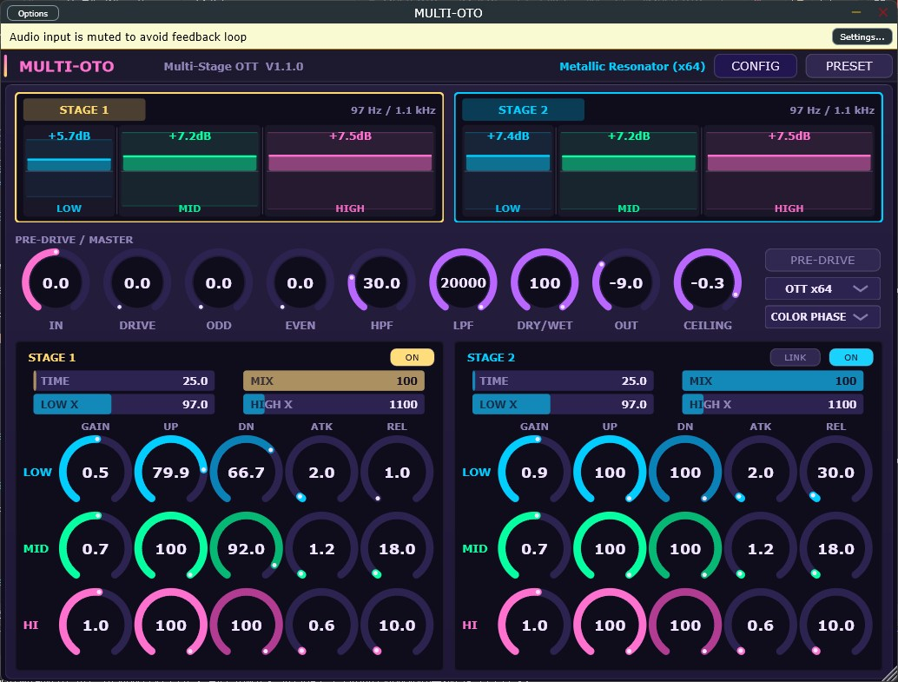

# MULTI-OTO


##


## Overview

**MULTI-OTO** is an open-source multiband dynamics and saturation VST3 plugin that cascades up to **128 multiband compression nodes in series**.

It is not a mixing or mastering utility — it is a **sound design tool**. Up to about 8 nodes it behaves like a conventional OTT, adding weight and brightness. Past 16 nodes it turns into an artifact generator, and the design deliberately allows the sound to break.

Built for Color Bass, Riddim and Neurofunk: extracting microscopic texture, generating infinite spectral sweeps, and producing phase-dispersion glitch effects that ordinary dynamics processors cannot reach.

👉 **[Demo video on X (動作デモ動画)](https://x.com/kijyoumusic/status/2055442936884826283?s=20)**

## Key Features

### Extreme Cascade Architecture

Selectable cascade count (2, 4, 8, 16, 32, 64, 128). Stage 1 owns the first half of the chain, Stage 2 the second half, each with its own settings.

### Independent Per-Stage Crossovers *(new in 1.1.0)*

Stage 1 and Stage 2 have **completely separate band splits**. Setting different crossovers per stage drops one stage's boundary inside the other's band, producing phase interference and resonance from the overlap. Band boundaries can also be dragged directly on the meters.

### True OTT Dynamics Engine

Simultaneous upward and downward compression per band, with RMS envelope detection and upward expansion capped at +36 dB so the signature tail can breathe without hitting a wall.

### Phase Dispersion & Glitch Textures

**COLOR PHASE** passes the signal through up to 128 uncompensated Linkwitz-Riley crossovers, accumulating massive group delay that stretches transients into laser sweeps. **ALIGN PHASE** routes the dry signal through the same phase rotation so Dry/Wet stays a clean blend.

### Pre-Drive ADAA Saturation

C2-continuous polynomial soft clipper with anti-derivative antialiasing. Independent Drive, Odd and Even harmonic controls.

### Modulation Matrix *(new in 1.1.0)*

Four LFOs with seven waves each (Sine / Triangle / Saw / Square / S&H / Chaos / **Rnd Trig**), free-running or tempo-synced. Two extra sources take the place of the velocity and note that an effect never receives: **Env Follow** tracks the input level, and **Drift** wanders continuously without ever stepping.

Eight slots route any source to 24 destinations — both stages' Time, crossovers, Mix and all twelve band attacks and releases, plus **the LFO rates themselves** so one LFO can stretch another's period. Frequencies and times modulate exponentially (±2 to ±3 octaves) rather than by addition, so they swing symmetrically instead of collapsing at the low end. Every modulated knob shows its live range as an arc.

### Preset Browser & Config

30 factory presets across Basic / Bass / Texture / Destroy / Drive / Utility, plus user preset saving. Ten colour themes that recolour the knobs and meters as well as the background, and a configurable limiter (LIMIT / CLIP mode, ceiling, release).

### AVX2 SIMD Engine

`DynamicsNode` and `ADAASaturator` are written in raw AVX2 intrinsics, processing 8 lanes at once, with vectorised fast `exp2` / `log2` for the decibel conversions.

## What's New in 1.1.0

**Fixed — the silence bug.** In 1.0.0, once the signal overflowed to `Inf`, the envelope state latched to `NaN` and the limiter envelope latched to `Inf`, permanently multiplying the output by zero with no way to recover. All node and limiter states are now sanitised and clamped, and every parameter is smoothed over 20 ms so knob moves cannot spike the cascade.

**Fixed — Drive / ODD / EVEN were effectively frozen.** Their smoothers advanced one sample per block instead of one per sample, so a knob move took roughly 25 seconds to arrive. They now respond in 0.05 s.

**Fixed — ALIGN PHASE did nothing.** The dry path was a no-op, so both phase modes sounded identical. It is now implemented properly.

**Fixed — crossover reconstruction error.** The low band was missing the high crossover's allpass, so the three bands did not sum flat. That error compounded across every stage. Corrected.

**New** — modulation matrix (4 LFOs + Env Follow + Drift, 8 slots, 24 destinations, live range display on every target knob), independent per-stage crossovers with LINK, meter boundary dragging, preset browser with 30 factory presets, CONFIG panel with ten colour themes and limiter mode/ceiling/release.

**Redesigned GUI** — knob diameter roughly doubled (31 px → 65 px), both stages visible at once in a 3 × 5 band matrix, window reduced from 880 × 750 to 880 × 620.

## System Requirements

* **OS**: Windows 10 / 11 (64-bit)
* **CPU**: AVX2 required (Intel Haswell 2013+ / AMD Excavator 2015+)
* **Format**: VST3, Standalone
* **Tested host**: Ableton Live 11 / 12

⚠️ Compiled and optimised exclusively for Windows. Verified in Ableton Live only. Other DAWs are unverified and unsupported.

## Installation

1. Download the latest `MULTI-OTO.vst3` from [Releases](https://github.com/OTODESK4193/MULTI-OTO/releases/latest).
2. Copy the **whole `MULTI-OTO.vst3` folder** (it is a bundle, not a single file) to `C:\Program Files\Common Files\VST3`.
3. Rescan plugins in your DAW.

## Building from Source

Requires JUCE 8 at `C:/JUCE` and Visual Studio 2022 or newer.

```
cmake -B out/build/x64-Release -G "Visual Studio 17 2022" -A x64 .
cmake --build out/build/x64-Release --config Release
```

`-A x64` is required — the Visual Studio generator defaults to Win32, which produces a plugin no 64-bit host can load.

## User Guide

* [日本語マニュアル](./Source/Assets/MULTI-OTO_UserManual_JP.md)
* [English manual](./Source/Assets/MULTI-OTO_UserManual_EN.md)

## Disclaimer & Stability

This software is provided "as is", without any warranty. Cascading 128 multiband compressors can produce extreme output levels depending on your settings. The built-in ceiling is always active, but **always place a limiter after MULTI-OTO** and watch your monitoring volume to protect your hearing and your speakers.

## License

GNU Affero General Public License v3.0 (AGPLv3) — see [LICENSE](LICENSE).
Built with the **JUCE 8** framework; distributed under AGPLv3 in accordance with JUCE 8's open-source licensing terms.

## Credits

**Developer**: [@kijyoumusic](https://x.com/kijyoumusic) (OTODESK)
**Target DAW**: Ableton Live 11+
**Framework**: JUCE 8.0.8
